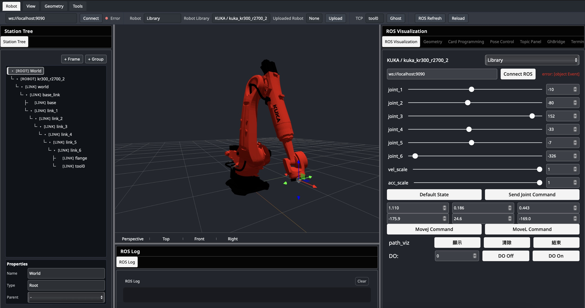

# robosim_library 貢獻指南

本文件說明如何為 robosim_library 貢獻機械手臂模型，包含檔案架構、URDF 規範、mesh 配置方式與新增模型流程。並以 ROS 座標與框架慣例作為開發標準，所有貢獻者在開發或更新機器人描述、座標階層、flange／tool0 定義，以及相關運動學資料時，應參考上述規範：

- [**ROS REP-103**](https://www.ros.org/reps/rep-0103.html)：通用單位與座標規範
- [**ROS REP-199**](https://gavanderhoorn.github.io/rep/rep-0199.html)：串聯式工業機械手臂之座標框架語意規範


## 專案總覽

robosim_library 是一個靜態機器人模型庫，為 [RoboSim](https://avery320.github.io/robot-demo/javascript/example/bundle/main.html) 提供基礎機械手臂的 URDF 描述檔與對應的 3D mesh 資源。

**歡迎貢獻自己的機械手臂模型，即可收入至 [RoboSim](https://avery320.github.io/robot-demo/javascript/example/bundle/main.html) 的模型庫（Robot Library）中。**

## 目錄結構

```
library/{vendor}/{model_id}/
├── model.json
├── urdf/{model_id}.urdf
└── meshes/{mesh_sub_dir}/
    ├── visual/       *.dae
    └── collision/    *.stl
```

> `meshes/` 底下的子目錄名稱可能與 `model_id` 不同（例如 ABB 的 `irb1200_5_90` 對應專案中的 `abb_irb1200`），此路徑由 URDF 內的 `<mesh filename>` 決定。

## model.json 規格

每個模型目錄必須包含一份 `model.json`，作為該模型的唯一資料來源。

```json
{
  "id": "abb_irb1200",
  "vendor": "ABB",
  "model": "IRB1200",
  "urdf": "library/abb/abb_irb1200/urdf/abb_irb1200.urdf",
  "author": "Avery Tsai",
  "source": "ros-industrial/abb"
}
```

### 欄位說明

| 欄位 | 必填 | 說明 |
|------|------|------|
| `id` | ✅ | 唯一識別碼，與模型目錄名稱一致 |
| `vendor` | ✅ | 廠牌名稱 |
| `model` | ✅ | 型號名稱 |
| `urdf` | ✅ | URDF 檔案的**相對路徑**（相對於專案根目錄） |
| `author` | ✅ | 作者 |
| `source` | ❌ | 原始來源（GitHub repo 或 URL） |

> `urdf` 欄位的路徑必須以 `library/` 開頭，且指向的 URDF 檔案必須實際存在。`generate_index.py` 會驗證此路徑。

## URDF 結構與 Mesh 引用

### Mesh 路徑引用方式

URDF 檔案統一使用**相對路徑**引用 mesh 檔案。由於 URDF 存放於 `urdf/` 子目錄，因此路徑以 `../meshes/` 開頭：

```xml
<visual>
  <geometry>
    <mesh filename="../meshes/irb1200_5_90/visual/base_link.dae"/>
  </geometry>
</visual>

<collision>
  <geometry>
    <mesh filename="../meshes/irb1200_5_90/collision/base_link.stl"/>
  </geometry>
</collision>
```

> 原始 URDF 可能包含 `package://` 前綴路徑，必須轉換為相對路徑才能正確載入。

#### 轉換方法

```bash
sed -i.bak 's|package://abb_irb1200_support/meshes|../meshes|g' abb_irb1200.urdf
```

## index.json
`library/index.json` 是由腳本從各 `model.json` 自動彙整而成，**不應手動編輯**，本腳本通常由作者審查後，手動執行，以更新 `library/index.json`。

```bash
python3 scripts/generate_index.py
```
### 腳本行為
1. 搜尋所有 `library/*/*/model.json` 檔案
2. 驗證必填欄位（`id`, `label`, `vendor`, `model`, `urdf`, `author`）
3. 驗證 `urdf` 路徑指向的檔案是否存在
4. 依 `vendor` → `model` → `id` 排序
5. 輸出至 `library/index.json`


## 新增模型流程

#### 1. 建立目錄結構

```bash
mkdir -p library/{vendor}/{model_id}/urdf
mkdir -p library/{vendor}/{model_id}/meshes/{mesh_sub_dir}/visual
mkdir -p library/{vendor}/{model_id}/meshes/{mesh_sub_dir}/collision
```

#### 2. 放置檔案

- 將 URDF 放入 `urdf/` 目錄
- 將模型檔放入 `meshes/{mesh_sub_dir}/` 目錄
  - `visual/` 目錄存放視覺模型
  - `collision/` 目錄存放碰撞模型

#### 3. 修正 Mesh 路徑

將 URDF 中的 `package://` 路徑替換為相對路徑，以 `../meshes/` 開頭：

```bash
sed -i.bak 's|package://<package_name>/meshes|../meshes|g' <model>.urdf
rm <model>.urdf.bak # 修正完成後刪除備份檔
```

#### 4. 驗證
進到 [RoboSim](https://avery320.github.io/robot-demo/javascript/example/bundle/main.html) 網站，在 Robot 樣板中選擇 "Upload"，點選新增的資料夾，即可看到模型是否能正確載入。
> 若無顯示模型請確認 URDF 路徑是否正確。



#### 5. 撰寫 model.json
在模型目錄下建立 `model.json`，填入必要欄位。


## Robot URDF
以下為從開源專案獲取 urdf 模型的方法。

### [UR robot](https://github.com/UniversalRobots/Universal_Robots_ROS2_Description.git)

```bash
rosrun xacro xacro --inorder ur.urdf.xacro ur_type:=ur5 name:=ur > ur5.urdf #name:=<robot name>
```

### [ABB robot](https://github.com/ros-industrial/abb.git)

```bash
rosrun xacro xacro irb1200_5_90.xacro > abb_irb1200.urdf
```

### [KUKA robot](https://github.com/kroshu/kuka_robot_descriptions.git)
